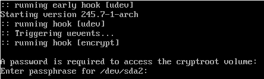

I recently re-installed my Arch Linux with [full disk encryption (FDE)](https://en.wikipedia.org/wiki/Disk_encryption), as one of the first steps, to bring [privacy](https://www.ted.com/talks/glenn_greenwald_why_privacy_matters) into my life. This guide documents the installation process in a step-by-step manner. I hope this can help people who also want to practice privacy.

Each step in this guide are linked to the corresponding ArchWiki, precised to section level. You are suggested to read these references and, of course, the [official installation guide](https://wiki.archlinux.org/index.php/installation_guide) because

- it is better to understand the process instead of blindly copy-and-pase, and
- I had omitted some uncommon steps that you might need (e.g., non US locale and keyboard layout)

This guide uses modern options like:

|                     | Options                           | This Setup       |
|---------------------|-----------------------------------|------------------|
| **Disk Encryption** | Yes, No                           | **Yes**          |
| **Firmware**        | BIOS, UEFI                        | **UEFI**         |
| **Disk Partition**  | MBR, GPT                          | **GPT**          |
| **Boot Loader**     | GRUB, Syslinux, systemd-boot, etc | **systemd-boot** |

In addition, I have verified this guide twice by installing on both hard disk and virtual machine respectively. I think it is reproducible.

Let's start!

### 1. Verify the boot mode ([ref](https://wiki.archlinux.org/index.php/installation_guide#Verify_the_boot_mode))

This guide assumes we use UEFI. You must ensure that the system is booted in UEFI mode. To verify the boot mode, list the efivars directory: 

```
# ls /sys/firmware/efi/efivars
```

If the command shows the directory without error, then the system is booted in UEFI mode.

### 2. Update the system clock ([ref](https://wiki.archlinux.org/index.php/installation_guide#Update_the_system_clock))

Use `timedatectl` to ensure the system clock is accurate: 

```
# timedatectl set-ntp true
```

### 3. Partition the disks ([ref](https://wiki.archlinux.org/index.php/installation_guide#Partition_the_disks), [GPT fdisk](https://wiki.archlinux.org/index.php/GPT_fdisk#Create_a_partition_table_and_partitions))

The final disk layout from this guide contains two partitions,

| Partition        | Size             | Code                    | Name                 |
|------------------|------------------|-------------------------|----------------------|
| Boot (/dev/sda1) | 512.0 MiB        | EF00                    | EFI system partition |
| Root (/dev/sda2) | Rest of the disk | 8300 (default of gdisk) | Linux filesystem     |

*Traditionally, it is suggested to create an extra swap partition. I don't because there are more flexible alternatives over allocating a fixed partition for swap. For example, uses [swap file](https://wiki.archlinux.org/index.php/swap#Swap_file), or [systemd-swap](https://wiki.archlinux.org/index.php/swap#systemd-swap) to automate the swap file on demand.*

Use `gdisk` to partition the disk. See this video:



When completed, `gdisk -l /dev/sda` should print the disk partitions like these:

```
GPT fdisk (gdisk) version 1.0.5

Partition table scan:
  MBR: protective
  BSD: not present
  APM: not present
  GPT: present

Found valid GPT with protective MBR; using GPT.
Disk /dev/sda: 41943040 sectors, 20.0 GiB
Model: VBOX HARDDISK
Sector size (logical/physical): 512/512 bytes
Disk identifier (GUID): 8EFD04A2-473C-4FCA-9C89-459EEB658DB0
Partition table holds up to 128 entries
Main partition table begins at sector 2 and ends at sector 33
First usable sector is 34, last usable sector is 41943006
Partitions will be aligned on 2048-sector boundaries
Total free space is 2014 sectors (1007.0 KiB)

Number  Start (sector)    End (sector)  Size       Code  Name
   1            2048         1050623   512.0 MiB   EF00  EFI system partition
   2         1050624        41943006    19.5 GiB   8300  Linux filesystem
```

### 4. Prepare the encrypted root partition ([ref](https://wiki.archlinux.org/index.php/Dm-crypt/Encrypting_an_entire_system#LUKS_on_a_partition))

Create and mount the encrypted root partition. You will need to choose the passphrase for the encryption!

```
# cryptsetup luksFormat /dev/sda2
# cryptsetup open /dev/sda2 cryptroot
# mkfs.ext4 /dev/mapper/cryptroot
# mount /dev/mapper/cryptroot /mnt
```

### 5. Prepare the boot partition ([ref](https://wiki.archlinux.org/index.php/Dm-crypt/Encrypting_an_entire_system#Preparing_the_boot_partition))

Create and mount the non-encrypted boot partition.

```
# mkfs.fat -F32 /dev/sda1
# mkdir /mnt/boot
# mount /dev/sda1 /mnt/boot
```

### 6. Generate an fstab file ([ref](https://wiki.archlinux.org/index.php/installation_guide#Fstab))

Run:

```
# genfstab -U /mnt >> /mnt/etc/fstab
```

### 7. Install essential packages ([ref](https://wiki.archlinux.org/index.php/installation_guide#Install_essential_packages))

Use the `pacstrap` script to install these packages. I added `vim` for editing config files and `dhcpcd` for connecting to the Internet after reboot.

```
# pacstrap /mnt base linux linux-firmware vim dhcpcd
```

### 8. Chroot ([ref](https://wiki.archlinux.org/index.php/installation_guide#Chroot))

```
# arch-chroot /mnt
```

### 9. Time zone ([ref](https://wiki.archlinux.org/index.php/installation_guide#Time_zone))

```
# ln -sf /usr/share/zoneinfo/America/Los_Angeles /etc/localtime
# hwclock --systohc
```

### 10. Localization ([ref](https://wiki.archlinux.org/index.php/installation_guide#Localization))

Edit `/etc/locale.gen` and uncomment `en_US.UTF-8 UTF-8` and other needed locales. Generate the locales by running: 

```
# locale-gen
# localectl set-locale LANG=en_US.UTF-8
```

### 11. Network configuration ([ref](https://wiki.archlinux.org/index.php/installation_guide#Fstab))

Add the  `/etc/hosts`:

```
127.0.0.1  localhost
::1        localhost
```

### 12. Configuring mkinitcpio ([ref](https://wiki.archlinux.org/index.php/Dm-crypt/Encrypting_an_entire_system#Configuring_mkinitcpio))

Edit `/etc/mkinitcpio.conf`,
- add the `encrypt` hooks
- move the `keyboard` hooks before `encrypt` ( so that you can type the passphrase :p )

For example, after this step, `HOOKS` should look like:

```
HOOKS=(base udev autodetect modconf block keyboard encrypt filesystems fsck)
```

### 13. Generate the initramfs ([ref](https://wiki.archlinux.org/index.php/installation_guide#Initramfs))

Since we have changed to `/etc/mkinitcpio.conf` manually, we have to re-generates the boot images (e.g., `/boot/initramfs-linux.img`). Run this command:

```
# mkinitcpio -P
```

### 14. Set the root password ([ref](https://wiki.archlinux.org/index.php/installation_guide#Root_password))

```
# passwd
```

### 15. Patch the CPU's microcode ([ref](https://wiki.archlinux.org/index.php/Microcode))

- For AMD processors, install the `amd-ucode` package.
- For Intel processors, install the `intel-ucode` package. 

For exmaple, run

```
# pacman -S intel-ucode
```


### 16. Configure the Boot Loader with `systemd-boot` ([ref](https://wiki.archlinux.org/index.php/installation_guide#Boot_loader), [systemd-boot](https://wiki.archlinux.org/index.php/Systemd-boot))

**16.1. Install the EFI boot manager**

```
# bootctl install
```

**16.2. Create `/boot/loader/entries/arch.conf`**

- Replace `intel-ucode.img` with `amd-ucode.img` if you have an AMD CPU
- Replace the `UUID` (not `PARTUUID`) to the one mapping to `/dev/sda2` (Run `blkid` to find out)

```
title   Arch Linux
linux   /vmlinuz-linux
initrd  /intel-ucode.img
initrd  /initramfs-linux.img
options cryptdevice=UUID=XXXXXXXX-XXXX-XXXX-XXXX-XXXXXXXXXXXX:cryptroot root=/dev/mapper/cryptroot rw
```

**16.3. Replace `/boot/loader/loader.conf` to**

```
default      arch.conf
timeout      5
console-mode max
editor       no
```

**16.4. Review the configuration**

```
# bootctl list
Boot Loader Entries:
        title: Arch Linux (default)
           id: arch.conf
       source: /boot/loader/entries/arch.conf
        linux: /vmlinuz-linux
       initrd: /intel-ucode.img
               /initramfs-linux.img
      options: cryptdevice=UUID=XXXXXXXX-XXXX-XXXX-XXXX-XXXXXXXXXXXX:cryptroot root=/dev/mapper/cryptroot rw
```

### 17. Reboot ([ref](https://wiki.archlinux.org/index.php/installation_guide#Reboot))

Exit the chroot environment by typing `exit` or pressing `Ctrl+d`. Then run `reboot`.

If everything works, it should ask for a password to access the cryptroot, like this screenshot below:



One last thing, if you computer, like mine, is sitting behind a DHCP (e.g., a typical router), you will need to enable `dhcpcd` to access the Internet. Run,

```
# systemctl enable dhcpcd
```

Congratulations! You have installed Arch Linux with Full Disk Encryption!
